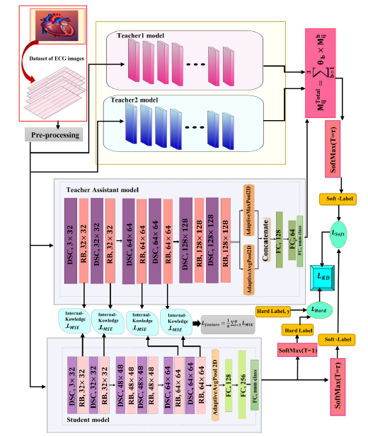

# HMT-KD: Hierarchical Multi-Teacher Knowledge Distillation for Lightweight ECG Classification

Official implementation of **HMT-KD**, a hierarchical multi-teacher knowledge distillation framework for accurate and lightweight ECG classification using response-based and feature-based knowledge transfer.

## Overview

Automated electrocardiogram (ECG) classification plays an important role in intelligent healthcare systems, particularly in wearable and resource-constrained environments where accurate diagnosis must be achieved with limited computational and memory resources.

Although deep neural networks provide powerful representation learning capabilities for ECG analysis, their large number of parameters and high computational complexity restrict their deployment on edge devices and real-time healthcare applications.

In this work, we propose **HMT-KD (Hierarchical Multi-Teacher Knowledge Distillation)**, a lightweight framework that transfers complementary knowledge from multiple teacher networks into a compact student model.

The proposed framework employs two high-capacity teacher networks:

- **ResNet-18 with SENet attention mechanism**
- **MobileNetV2**

These teacher networks are optimized to extract rich ECG representations. A lightweight **Teacher Assistant (TA)** network is then trained using knowledge distillation from both teachers, providing an intermediate representation bridge between the complex teacher models and the final lightweight student.

The final student model is trained using two parallel knowledge transfer pathways:

1. **Response-based Knowledge Distillation**

   The student learns from the soft prediction outputs of ResNet18-SENet, MobileNetV2, and the Teacher Assistant.

2. **Feature-based Knowledge Distillation**

   Intermediate feature representations extracted from the Teacher Assistant are transferred to the student network to improve feature learning capability.

The student architecture is designed using efficient deep learning components, including **depthwise separable convolutions**, **residual learning blocks**, and **attention mechanisms**, enabling high diagnostic performance with a significantly reduced model size.

The proposed HMT-KD framework was evaluated on the **PTB-XL** and **Chapman/Shaoxing 12-lead ECG datasets**.

With only **101,600 trainable parameters**, the proposed student model achieves:

| Dataset | Accuracy | AUROC |
|---------|----------|-------|
| PTB-XL | 85.45% | 96.53% |
| Chapman | 94.42% | 98.86% |

Compared with the ResNet18 + SENet teacher network containing **11.2M parameters**, the proposed student model reduces the parameter size by approximately **110×**, corresponding to more than **99% reduction in model complexity** while maintaining competitive classification performance.

These results demonstrate the effectiveness of HMT-KD for developing lightweight ECG classification models suitable for wearable healthcare systems and real-time IoMT applications.

  

**Fig. 6.** A schematic overview of the proposed Hierarchical Multi-Teacher Knowledge Distillation (HMT-KD) framework, integrating response-based and feature-based pathways. The response-based KD exploits the outputs of ResNet-18 with SENet, MobileNetV2, and the Teacher Assistant, while the feature-based KD transfers intermediate representations from the TA to the student.

---

# Dataset

The proposed HMT-KD framework was trained and evaluated using two publicly available benchmark ECG datasets:

1. Chapman/Shaoxing 12-lead ECG Database  
2. PTB-XL ECG Dataset  

---

# 1. Chapman/Shaoxing 12-lead ECG Database

The Chapman/Shaoxing dataset contains **12-lead ECG recordings** sampled at **500 Hz** with a duration of **10 seconds**.

Four diagnostic classes were used in this study:

| Class | Description |
|------|-------------|
| SR | Normal Sinus Rhythm |
| SB | Sinus Bradycardia |
| GSVT | General Supraventricular Tachycardia |
| AFIB | Atrial Fibrillation |

### Dataset source

The dataset is publicly available through Kaggle:

[Chapman/Shaoxing 12-lead ECG Database — Kaggle](https://www.kaggle.com/datasets/erarayamorenzomuten/chapmanshaoxing-12lead-ecg-database)

---

# 2. PTB-XL ECG Dataset

PTB-XL is a large-scale publicly available 12-lead ECG dataset containing clinical ECG recordings annotated by expert cardiologists.

In this study, the **superdiagnostic classification scheme** was adopted.

Five diagnostic classes were used:

| Class | Description |
|------|-------------|
| NORM | Normal ECG |
| MI | Myocardial Infarction |
| STTC | ST/T Change |
| CD | Conduction Disturbance |
| HYP | Hypertrophy |

### Dataset source

The PTB-XL dataset is publicly available through PhysioNet:

[PTB-XL — PhysioNet](https://physionet.org/content/ptb-xl/1.0.3/)

---

# Experimental Setup

All experiments were implemented using **PyTorch** and conducted on the **Kaggle GPU platform**.

## Environment

| Component | Configuration |
|-----------|---------------|
| Python | 3.12.13 |
| PyTorch | 2.10.0 |
| CUDA | 12.8 |
| GPU | 2 × NVIDIA Tesla T4 |
| GPU Memory | 15 GB per GPU |
| Input Resolution | 300 × 300 |
| Epochs | 65 |
| Batch Size | 128 |
| Optimizer | AdamW |
| Learning Rate | 4 × 10⁻⁴ |
| Weight Decay | 1 × 10⁻⁵ |
| Temperature | 2.0 |
| KD Weight (α) | 0.7 |
| Feature KD Weight (β) | 0.2 |

---

# Training Strategy

The training procedure consists of three main stages:

1. **Teacher Network Training**

   ResNet18-SENet and MobileNetV2 are optimized as high-capacity teacher models.

2. **Teacher Assistant Knowledge Transfer**

   The Teacher Assistant learns from the combined soft predictions of both teacher networks.

3. **Student Knowledge Distillation**

   The lightweight student model is trained using hierarchical supervision from:

   - MobileNetV2
   - ResNet18-SENet
   - Teacher Assistant

   through response-based and feature-based distillation pathways.

---

# Evaluation Metrics

The proposed framework is evaluated using the following standard classification metrics:

- Accuracy
- Recall (Sensitivity)
- Precision
- Specificity
- F1-Score
- AUROC

---

# Results

## Performance Comparison on PTB-XL Dataset

| Model | Precision | Recall | F1-score | Accuracy | Specificity | AUROC | Parameters |
|------|-----------|--------|----------|----------|-------------|-------|------------|
| MobileNetV2 (Teacher) | 0.7790 | 0.7090 | 0.7390 | 0.8539 | 0.9538 | 0.9619 | 2,230,277 |
| ResNet18 + SENet (Teacher) | 0.8052 | 0.7267 | 0.7565 | 0.8527 | 0.9518 | 0.9675 | 11,220,853 |
| Teacher Assistant (TA) | 0.7933 | 0.7150 | 0.7420 | 0.8558 | 0.9565 | 0.9687 | 194,880 |
| Student (Without KD) | 0.6829 | 0.5819 | 0.6178 | 0.7424 | 0.9092 | 0.8898 | 101,600 |
| Student (With HMT-KD) | 0.8074 | 0.7433 | 0.7622 | 0.8545 | 0.9569 | 0.9653 | 101,600 |

The results demonstrate that HMT-KD significantly improves the performance of the lightweight student model.

Without knowledge distillation, the student network achieves:

- Accuracy: **74.24%**
- AUROC: **88.98%**

After applying the proposed hierarchical multi-teacher knowledge transfer strategy, the student model achieves:

- Accuracy: **85.45%**
- AUROC: **96.53%**

The proposed student network contains only **101,600 parameters**, while the ResNet18 + SENet teacher contains **11,220,853 parameters**.

Therefore, HMT-KD achieves:

- Approximately **110× parameter reduction**
- More than **99% reduction in model complexity**

while maintaining comparable diagnostic performance.

These results confirm that the proposed HMT-KD framework provides an effective solution for lightweight, accurate, and real-time ECG classification in resource-constrained healthcare applications.
